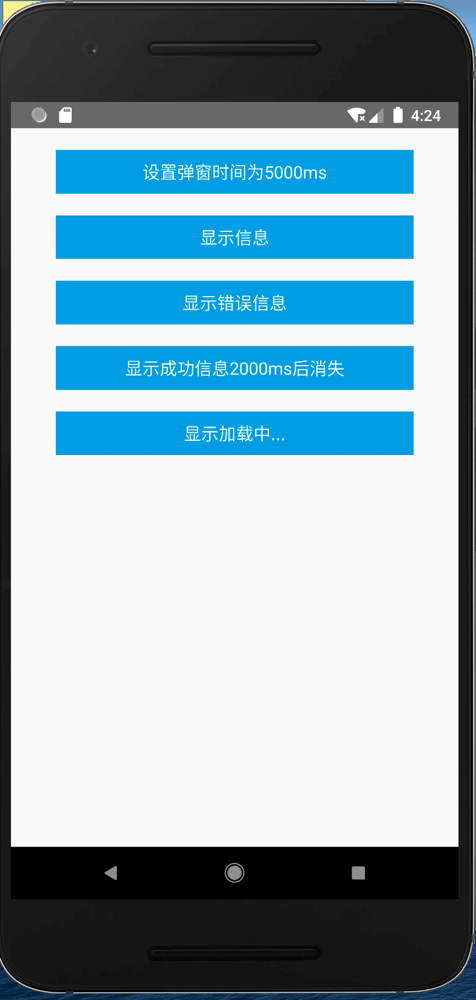

# react-native-rmodal



# 使用方式

## 配置弹出显示时间

```typescript jsx
/**
 * Sample React Native App
 * https://github.com/facebook/react-native
 *
 * Generated with the TypeScript template
 * https://github.com/react-native-community/react-native-template-typescript
 *
 * @format
 */

import React, { useState, } from 'react';
import {
  StyleSheet,
  Text,
  View,
  TouchableOpacity,
} from 'react-native';
import RModal, { RModalParent, RModalConfig, } from './src';

interface BtnProps {
  text: string;
  onPress: (n: any) => any;
}

const Btn = (props: BtnProps) => {
  return (
    <TouchableOpacity style={styles.btn} onPress={props.onPress}>
      <Text style={styles.btn_text}>{props.text}</Text>
    </TouchableOpacity>
  );
};

const App = () => {
  const [duration, setDuration] = useState(2000);

  const setDefaultTime = () => {
    const t = duration === 2000 ? 5000 : 2000;
    setDuration(t);
    RModalConfig.setDefaultDuration(t);
  };


  const showInfo = () => {
    RModal.info(
      '这是一段很长的问题这是一段很长的问题这是一段很长的问题这是一段很长的问题这是一段很长的问题这是一段很长的问题',
      2000,
      () => console.log('close modal 1'),
    );
  };

  const showFail = () => {
    RModal.fail(
      '网络错误！',
      0,
      () => console.log('close modal'),
    );
    setTimeout(() => {
      RModalConfig.hide();
    }, 2000);
  };

  const showSuccess = () => {
    RModal.success('操作成功！');
  };

  const showLoading = () => {
    RModal.loading();
    setTimeout(() => {
      RModalConfig.hide();
    }, 2000);
  };

  return (
    <RModalParent>
      <View>
        <Btn text={`设置弹窗时间为${duration === 2000 ? 5000 : 2000 }ms`} onPress={setDefaultTime} />
        <Btn text="显示信息" onPress={showInfo} />
        <Btn text="显示错误信息" onPress={showFail} />
        <Btn text={`显示成功信息${duration}ms后消失`} onPress={showSuccess} />
        <Btn text="显示加载中..." onPress={showLoading} />
      </View>
    </RModalParent>
  );
};

const styles = StyleSheet.create({
  btn: {
    backgroundColor: '#00a6e2',
    width: '80%',
    height: 40,
    alignSelf: 'center',
    justifyContent: 'center',
    alignItems: 'center',
    marginTop: 20,
  },
  btn_text: {
    color: '#fff',
    fontSize: 16,
  },
});

export default App;

```
